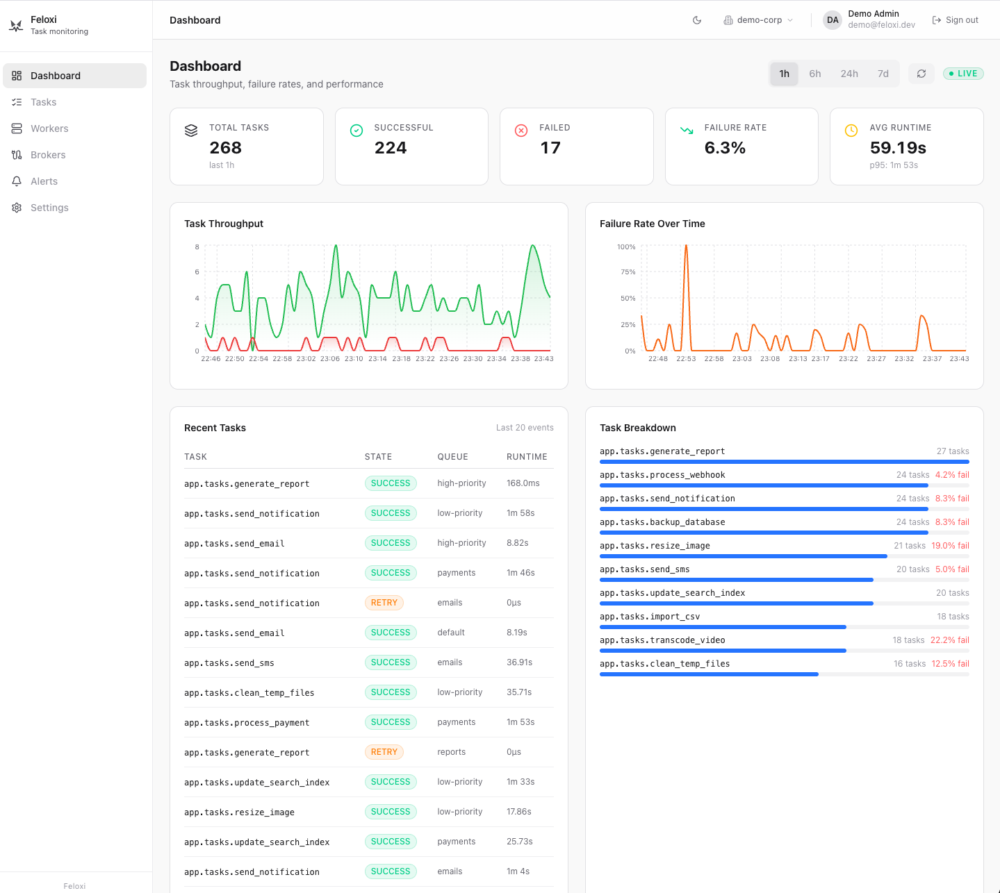
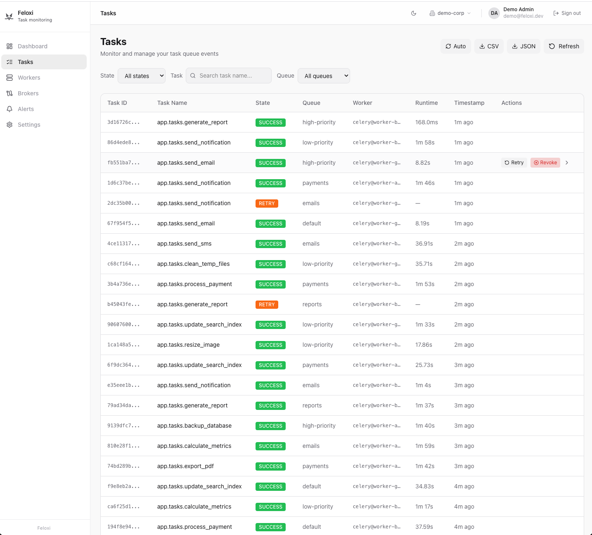
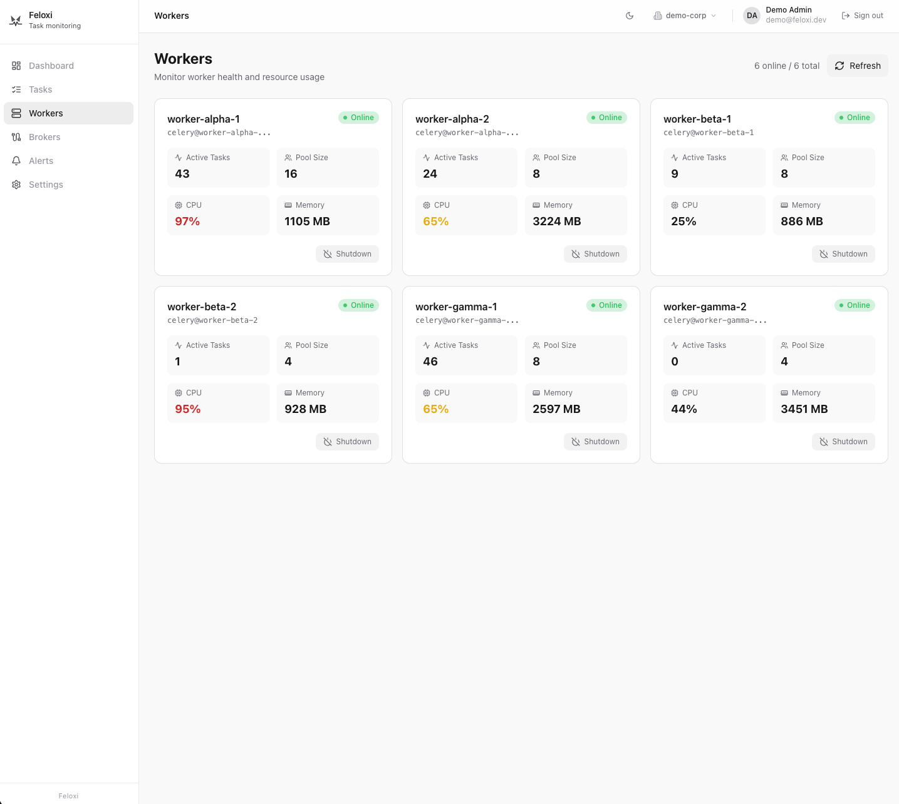
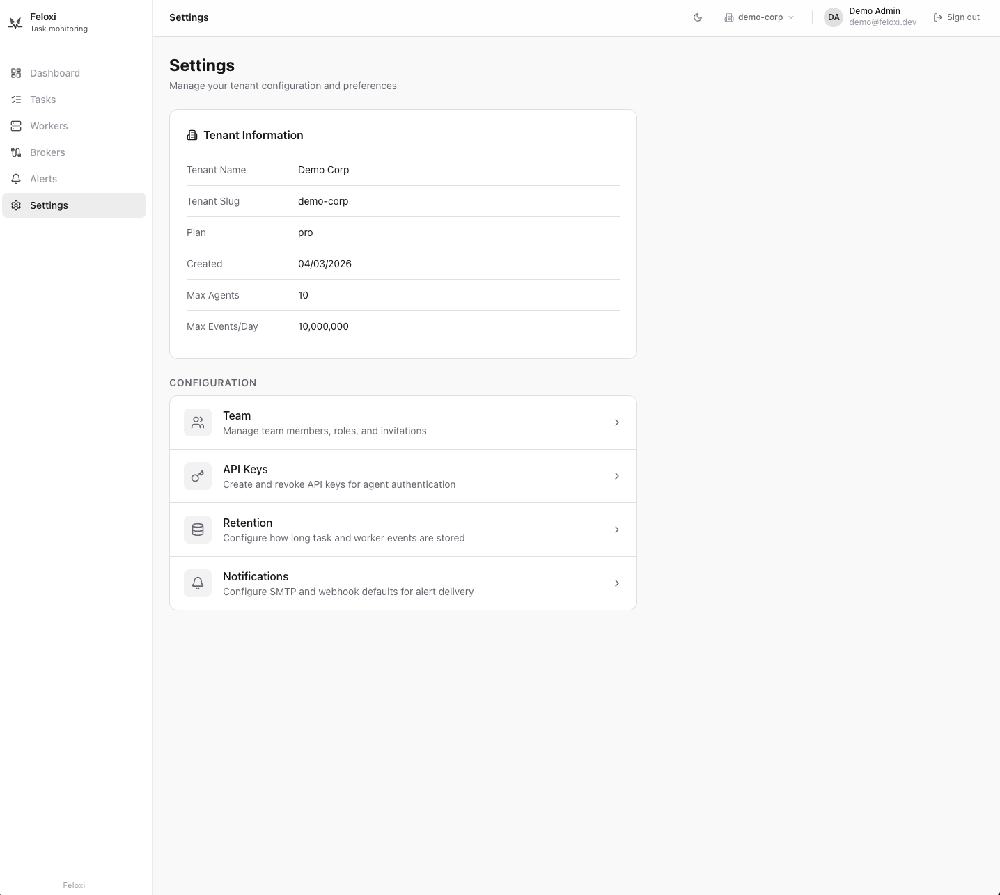

<p align="center">
  
</p>

<h1 align="center">Feloxi</h1>

<p align="center">
  <strong>The modern, open-source Celery monitoring platform.<br/>Built because <a href="https://github.com/mher/flower">Flower</a> wasn't enough.</strong>
</p>

<p align="center">
  <a href="https://github.com/feloxi/feloxi/actions"></a>
  <a href="LICENSE"></a>
  <a href="https://github.com/feloxi/feloxi/releases"></a>
</p>

---

<p align="center">
  
</p>

<p align="center">
  
  
  
</p>

## Features

- **Real-time dashboard** &mdash; Live task throughput, failure rates, and worker status via WebSocket
- **Task explorer** &mdash; Search, filter, and inspect any task. View args, kwargs, results, tracebacks, and full state timelines
- **Worker monitoring** &mdash; CPU, memory, pool size, active tasks, and processed counts for every worker
- **Broker management** &mdash; Connect Redis or RabbitMQ brokers from the UI. Live queue depth monitoring
- **Alerting engine** &mdash; 10 alert condition types with Slack, email, webhook, and PagerDuty notifications. Anti-flap controls and delivery tracking
- **Task actions** &mdash; Retry and revoke tasks directly from the dashboard via broker commands
- **Multi-tenant RBAC** &mdash; 4 roles, 14 permissions, API key auth for programmatic access
- **Data retention** &mdash; Configurable per-resource TTLs enforced via ClickHouse
- **Dark and light mode** &mdash; Full theme support across every page
- **OpenAPI spec** &mdash; Swagger UI at the API root (`/`) with auto-generated TypeScript client
- **Self-hosted** &mdash; Single `docker compose up` deploys everything. Your data never leaves your infrastructure

## Why Feloxi?

[Flower](https://github.com/mher/flower) is the most popular Celery monitoring tool, and for years it's been the default choice. But anyone running Celery at scale has hit its limitations:

| Problem with Flower                                                                                                                                                                                                                                                            | How Feloxi solves it                                                                                                                                                              |
| ------------------------------------------------------------------------------------------------------------------------------------------------------------------------------------------------------------------------------------------------------------------------------ | --------------------------------------------------------------------------------------------------------------------------------------------------------------------------------- |
| **In-memory storage** &mdash; All task data lives in RAM. Restart Flower and everything is gone. Hit an OOM kill under load and your monitoring history disappears. ([#1007](https://github.com/mher/flower/issues/1007), [#1085](https://github.com/mher/flower/issues/1085)) | **ClickHouse persistent storage** &mdash; Every task and worker event is stored in ClickHouse with configurable retention. Survives restarts, handles billions of events.         |
| **One instance per broker** &mdash; If you have staging + production Redis, or Redis + RabbitMQ, you need separate Flower processes and separate URLs.                                                                                                                         | **Multi-broker from one instance** &mdash; Connect any number of Redis and RabbitMQ brokers from the dashboard. Monitor everything in one place.                                  |
| **No historical analytics** &mdash; Flower shows current state only. You can't answer "what was the failure rate last Tuesday?" or "how has p95 latency trended this week?"                                                                                                    | **Time-series analytics** &mdash; Throughput charts, failure rate trends, queue depth over time. Powered by ClickHouse materialized views with 1h/6h/24h/7d time range selectors. |
| **No alerting** &mdash; Flower has no built-in alerts. You need external tools to detect failures, slow tasks, or offline workers.                                                                                                                                             | **10 alert condition types** &mdash; Failure rate, slow tasks, worker offline, queue depth, throughput anomaly, and more. Notify via Slack, email (SMTP), webhook, or PagerDuty.  |
| **Dated UI** &mdash; Built on jQuery 1.7.2 and Bootstrap. No dark mode, no responsive layout, no keyboard navigation.                                                                                                                                                          | **Modern React 19 UI** &mdash; Next.js 15 with Tailwind CSS v4, full dark/light theme, responsive layout, interactive Recharts visualizations.                                    |
| **Polling-based updates** &mdash; jQuery long-polling with configurable intervals. Not truly real-time.                                                                                                                                                                        | **WebSocket streaming** &mdash; Live task and worker events pushed over WebSocket. Zero-latency dashboard updates via Zustand stores.                                             |
| **No access control** &mdash; Anyone with the URL can see everything, retry/revoke tasks, and shut down workers.                                                                                                                                                               | **Multi-tenant RBAC** &mdash; 4 system roles (admin, editor, viewer, readonly) with 14 granular permissions. JWT auth with HttpOnly cookie refresh tokens.                        |
| **LRU eviction only** &mdash; When memory fills up, oldest tasks are silently dropped. No control over what's kept.                                                                                                                                                            | **Configurable retention policies** &mdash; Set per-resource TTLs (task events, worker events, alert history). Enforced automatically via ClickHouse TTL.                         |

Feloxi was built from the ground up as a **Flower alternative** for teams that need persistent storage, real-time analytics, multi-broker support, and production-grade alerting &mdash; without sending data to a SaaS.

> If you're evaluating Celery monitoring tools &mdash; [Flower](https://flower.readthedocs.io/), [django-celery-results](https://github.com/celery/django-celery-results), or SaaS options like Sentry or Cronitor &mdash; Feloxi gives you the most complete self-hosted solution with zero vendor lock-in.

## Quick Start

```bash
git clone https://github.com/feloxi/feloxi.git
cd feloxi
cp .env.example .env
docker compose up -d
```

This starts PostgreSQL, ClickHouse, Redis, the Rust API server, the Next.js frontend, and seeds demo data automatically.

Open **http://localhost:3000** and sign in:

| Field    | Value             |
| -------- | ----------------- |
| Email    | `demo@feloxi.dev` |
| Password | `password123`     |

You'll see the dashboard populated with 50,000 task events, 5,000 worker events, and 6 simulated workers.

### Connect Your Celery Workers

No agent or SDK required. Enable Celery events and point Feloxi at the same broker your workers use:

```bash
# Start workers with events enabled
celery -A myapp worker --loglevel=info --events
```

Then add your broker URL in the Feloxi dashboard under **Brokers > Add Broker**. Task and worker data starts flowing immediately.

## Architecture

```
Celery Workers ──events──> Broker (Redis / RabbitMQ)
                                    |
                              +-----------+
                              | Feloxi    |
                              | API       | :8080
                              | (Rust)    |
                              +--+--+--+--+
                                 |  |  |
                        +--------+  |  +--------+
                        v           v           v
                  +----------+ +----------+ +----------+
                  |PostgreSQL| |ClickHouse| |  Redis   |
                  | Auth &   | |  Events  | |Real-time |
                  | Config   | |& Metrics | |  State   |
                  +----------+ +----------+ +----------+
                                    |
                              +-----------+
                              | Next.js   | :3000
                              | Frontend  |
                              +-----------+
```

| Component                       | Role                                                                               |
| ------------------------------- | ---------------------------------------------------------------------------------- |
| **Rust API** (Axum, Tokio)      | HTTP + WebSocket server, broker consumers, alert evaluation, retention enforcement |
| **Next.js Frontend** (React 19) | Dashboard, task explorer, worker monitoring, broker management, settings           |
| **PostgreSQL 17**               | Users, tenants, roles, broker configs, alert rules, API keys, retention policies   |
| **ClickHouse 24.12**            | Task events, worker events, materialized views for metrics aggregation             |
| **Redis 7**                     | Live worker state, queue depths, heartbeat tracking                                |

The API connects directly to your Celery broker (Redis pub/sub or AMQP) to consume task and worker events. Events are stored in ClickHouse for history and analytics, while Redis maintains real-time worker state. The frontend connects over WebSocket for live updates and REST for historical queries.

## What You Get

### Dashboard

Real-time overview with throughput charts, failure rate trends, summary cards (total tasks, success/failure counts, failure rate, avg runtime), recent task stream, and task breakdown by name. Time range selector (1h / 6h / 24h / 7d).

### Task Explorer

Full task list with state, queue, and task name filters. Click any task for the detail view: complete state timeline, args/kwargs, result, exception with traceback, runtime, retries, and retry/revoke actions sent directly through the broker.

### Worker Monitoring

Card grid showing every worker with live CPU, memory, pool size, and active task counts. Color-coded health indicators. Click through to worker detail with recent event timeline, load averages (1m/5m/15m), and remote shutdown capability.

### Broker Management

Add Redis or RabbitMQ brokers from a 3-step wizard. Test connections before saving. Start/stop individual brokers. Per-broker stats: total events, hourly throughput, success rate, queue depths, and top tasks.

### Alerting

Create rules with conditions like failure rate thresholds, slow task detection, worker offline alerts, queue depth limits, throughput anomalies (Z-score), latency anomalies, and error rate spikes. Route notifications to Slack, email (SMTP), webhooks, or PagerDuty. Cooldown periods and failure tolerance prevent alert storms. Full firing history with per-channel delivery logs and payload tracking.

### Settings

Tenant configuration, team member management (invite with role assignment), API key generation with granular permissions, data retention policies (task events, worker events, alert history), and SMTP/webhook notification configuration with test delivery.

## Feloxi vs Flower vs SaaS

| Capability              |          Feloxi           | [Flower](https://github.com/mher/flower) | SaaS (Sentry, Cronitor) |
| ----------------------- | :-----------------------: | :--------------------------------------: | :---------------------: |
| Persistent task history |        ClickHouse         |              In-memory only              |      Cloud-hosted       |
| Multi-broker support    |            Yes            |             One per instance             |         Varies          |
| Real-time WebSocket     |            Yes            |              jQuery polling              |           Yes           |
| Historical analytics    |    Time-series charts     |            Current state only            |           Yes           |
| Alerting                | 10 conditions, 4 channels |                   None                   |           Yes           |
| RBAC / multi-tenant     |  4 roles, 14 permissions  |                   None                   |           Yes           |
| Self-hosted             |            Yes            |                   Yes                    |           No            |
| Open source             |        Apache 2.0         |                   BSD                    |           No            |
| Data ownership          |        100% yours         |                100% yours                |      Vendor-hosted      |
| Cost at scale           |    Infrastructure only    |           Infrastructure only            |    Per-event pricing    |

## Configuration

All configuration is via environment variables. See [docs/configuration.md](docs/configuration.md) for the full reference.

**API Server (required):**

| Variable         | Default                  | Description                                       |
| ---------------- | ------------------------ | ------------------------------------------------- |
| `DATABASE_URL`   | &mdash;                  | PostgreSQL connection string                      |
| `CLICKHOUSE_URL` | `http://localhost:8123`  | ClickHouse HTTP endpoint                          |
| `REDIS_URL`      | `redis://localhost:6379` | Redis connection string                           |
| `JWT_SECRET`     | &mdash;                  | Secret key for JWT signing (change in production) |
| `CORS_ORIGIN`    | `http://localhost:3000`  | Comma-separated allowed origins                   |
| `PORT`           | `8080`                   | API server port                                   |

**Frontend:**

| Variable              | Default                 | Description                                          |
| --------------------- | ----------------------- | ---------------------------------------------------- |
| `NEXT_PUBLIC_API_URL` | `http://localhost:8080` | API server URL (WebSocket URL derived automatically) |

## Production Deployment

For production, use the production compose overrides:

```bash
docker compose -f docker-compose.yml -f docker-compose.prod.yml up -d
```

Key production checklist:

- Set a strong `JWT_SECRET` (at least 32 random characters)
- Configure `CORS_ORIGIN` to your actual frontend domain
- Use managed PostgreSQL and Redis for persistence and HA
- Place behind a reverse proxy (nginx/Caddy) with TLS
- Set `RUST_LOG=api=warn,tower_http=warn` to reduce log volume

See [docs/self-hosting.md](docs/self-hosting.md) for the full production guide including nginx TLS configuration, horizontal scaling, and resource sizing.

## Tech Stack

| Layer          | Technology                                                              |
| -------------- | ----------------------------------------------------------------------- |
| API Server     | Rust, Axum, Tokio, SQLx, Tower                                          |
| Event Store    | ClickHouse with SummingMergeTree materialized views                     |
| Auth           | JWT (HS256) with HttpOnly cookie refresh tokens, Argon2 passwords, RBAC |
| Frontend       | Next.js 15, React 19, Tailwind CSS v4, Recharts, Zustand                |
| Protocol       | WebSocket with JSON messages, auto-reconnect                            |
| Alerting       | Slack, Email (SMTP via lettre), Webhook, PagerDuty                      |
| Infrastructure | Docker Compose, PostgreSQL 17, Redis 7, ClickHouse 24.12                |

## Documentation

| Document                               | Description                                    |
| -------------------------------------- | ---------------------------------------------- |
| [Architecture](docs/architecture.md)   | System design, data flow, Rust crate structure |
| [Configuration](docs/configuration.md) | All environment variables and defaults         |
| [Self-Hosting](docs/self-hosting.md)   | Production deployment guide                    |
| [Sizing](docs/sizing.md)               | Resource planning from <100K to 10M+ tasks/day |

## Contributing

Contributions are welcome. See [CONTRIBUTING.md](CONTRIBUTING.md) for setup instructions, code style, and PR guidelines.

Look for issues labeled **good first issue** to get started.

## Community

- [GitHub Discussions](https://github.com/feloxi/feloxi/discussions) &mdash; Questions and ideas
- [Discord](https://discord.gg/feloxi) &mdash; Real-time chat

## Acknowledgments

Feloxi was inspired by [Flower](https://github.com/mher/flower), the original Celery monitoring tool by [Mher Movsisyan](https://github.com/mher). Flower pioneered browser-based Celery monitoring and remains the most widely-used option. Feloxi builds on that foundation with persistent storage, real-time analytics, and production-grade alerting for teams running Celery at scale.

## License

Apache 2.0 &mdash; see [LICENSE](LICENSE) for details.
