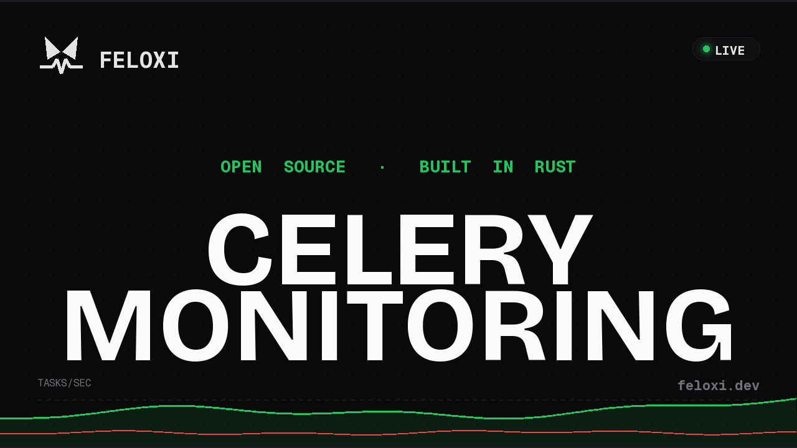
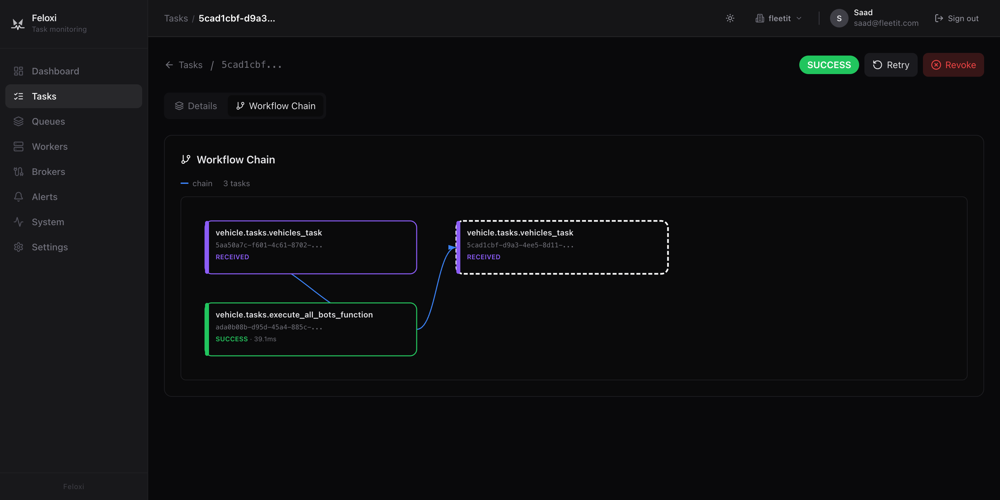
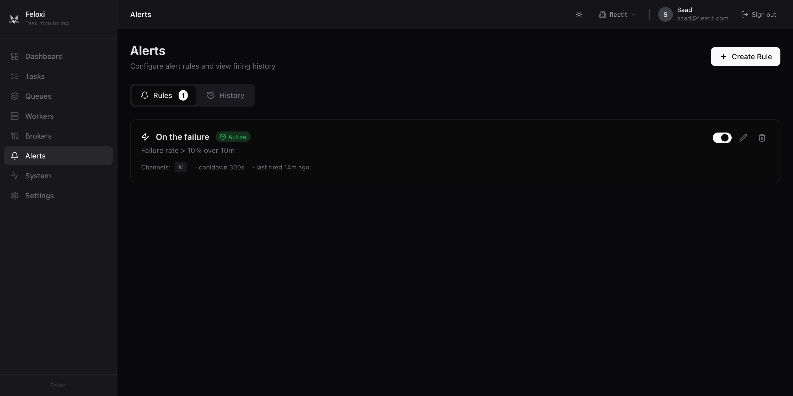
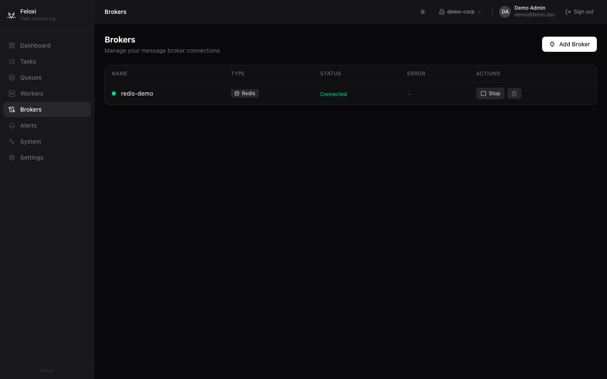

<p align="center">
  
</p>

<h1 align="center">Feloxi</h1>

<p align="center">
  <strong>Self-hosted monitoring for Python task queues.</strong><br/>
  Live dashboards, searchable task history, and alerting that fires.
</p>

<p align="center">
  <a href="https://github.com/thesaadmirza/feloxi/actions/workflows/ci-rust.yml"></a>
  <a href="https://github.com/thesaadmirza/feloxi/actions/workflows/ci-frontend.yml"></a>
  <a href="LICENSE"></a>
  <a href="https://github.com/thesaadmirza/feloxi/releases"></a>
  <a href="charts/feloxi"></a>
</p>

---

<p align="center">
  <a href="https://youtu.be/rcOrdcSi4gE">
    
  </a>
  <br/>
  <sub><a href="https://youtu.be/rcOrdcSi4gE">▶ Watch the walkthrough on YouTube</a></sub>
</p>

<p align="center">
  
</p>

Feloxi is a self-hosted Celery monitoring platform. It connects to your broker (Redis or RabbitMQ), reads the events Celery already emits, and stores them in ClickHouse so they outlive a restart. The dashboard runs on WebSocket for live updates. There's no agent to install and no SDK to integrate.

## What you can do

### Find any task

Full-text search across task ID, name, args, kwargs, result, and exception. Filter by state, queue, worker, and time range. Click any task for the state timeline, traceback, runtime, retries, and retry/revoke actions sent through the broker. Switch to the failures view to see exceptions grouped by type — one row per unique exception with occurrence counts, affected task names, and an expandable traceback.

<p align="center">
  
</p>

### Watch worker health

CPU, memory, pool size, active task counts, and heartbeat gaps. Load averages over 1m/5m/15m. Remote shutdown from the UI. Color-coded health indicators at a glance.

<p align="center">
  
</p>

### Visualize workflows

Celery chains, groups, and chords rendered as interactive DAGs. When a multi-stage pipeline fails, you can see which step broke without reading logs or correlating task IDs.

<p align="center">
  
</p>

### Track periodic tasks

The Beat Scheduler page shows every periodic task registered with Celery Beat — schedule expression, last run, next expected run, and how many beats have been missed. A missed-beat alert condition fires when a scheduled task stops running on time.

### Alert on what matters

Ten alert condition types: failure rate, slow tasks, worker offline, queue depth, throughput anomaly, latency anomaly, error rate spike, beat missed, no events, task failed. Route to Slack, email, webhook, or PagerDuty. Cooldown periods prevent alert storms. Delivery logs show which channels actually received each firing.

<p align="center">
  
</p>

### Manage brokers in one place

Add Redis or RabbitMQ brokers through a 3-step wizard with connection testing. Start, stop, and monitor each broker independently. Per-broker stats include total events, hourly throughput, success rate, queue depths, and top tasks. Monitor staging and production from the same dashboard.

<p align="center">
  
</p>

### Export to Prometheus

`GET /metrics` on the API server exposes a Prometheus-compatible scrape endpoint. No authentication required — protect it at the network level in production.

```
# HELP feloxi_tasks_total Number of tasks in the last 60 minutes by state
feloxi_tasks_total{state="total"} 4821
feloxi_tasks_total{state="succeeded"} 4612
feloxi_tasks_total{state="failed"} 209

# HELP feloxi_task_failure_rate_percent Task failure rate over the last 60 minutes
feloxi_task_failure_rate_percent 4.33

# HELP feloxi_task_avg_runtime_seconds Average task runtime over the last 60 minutes
feloxi_task_avg_runtime_seconds 1.042

# HELP feloxi_queue_depth Live queue depth reported by the broker
feloxi_queue_depth{queue="celery"} 12
feloxi_queue_depth{queue="priority"} 0

# HELP feloxi_workers_online Number of workers that sent a heartbeat recently
feloxi_workers_online 6
```

To disable it, set `DISABLE_PROMETHEUS=true`.

## Quick start

```bash
git clone https://github.com/thesaadmirza/feloxi.git
cd feloxi
cp .env.example .env
docker compose up -d
```

This boots PostgreSQL, ClickHouse, Redis, the Rust API server, the Next.js frontend, and seeds 50,000 task events across 6 simulated workers. Open [http://localhost:3000](http://localhost:3000) and sign in:

| Field    | Value             |
| -------- | ----------------- |
| Email    | `demo@feloxi.dev` |
| Password | `password123`     |

### Connect your workers

No agent to install. No SDK to wrap your tasks with. Three config settings and your broker URL is all Feloxi needs.

**Step 1** — Add to your `celeryconfig.py` (or `app.conf`):

```python
worker_send_task_events = True   # task-started, task-succeeded, task-failed
task_send_sent_event = True      # task-sent (shows PENDING state)
task_track_started = True        # task-started (shows STARTED state)
```

**Step 2** — Restart workers with `--events`:

```bash
celery -A myapp worker --loglevel=info --events
```

**Step 3** — Add your broker in Feloxi: **Brokers → Add Broker**. Enter your Redis or RabbitMQ URL and click **Connect**. Tasks start appearing within seconds.

See [docs/connecting-celery.md](docs/connecting-celery.md) for a full guide including API-based registration, Kubernetes setups, and troubleshooting.

### Try the example app

The [`examples/`](examples/) directory contains a ready-made Python Celery app with Redis and RabbitMQ variants — chains, groups, chords, realistic failure rates, Celery Beat periodic tasks, and a load generator. One command:

```bash
cd examples
docker compose up -d
# open http://localhost:3000 → Brokers → Add Broker → redis://redis:6379
```

See [examples/README.md](examples/README.md) for full instructions.

## Architecture

```
Celery Workers ──events──> Broker (Redis / RabbitMQ)
                                    |
                              +-----------+
                              | Feloxi    |
                              | API       | :8080
                              | (Rust)    |
                              +--+--+--+--+
                                 |  |  |
                        +--------+  |  +--------+
                        v           v           v
                  +----------+ +----------+ +----------+
                  |PostgreSQL| |ClickHouse| |  Redis   |
                  | Auth &   | |  Events  | |Real-time |
                  | Config   | |& Metrics | |  State   |
                  +----------+ +----------+ +----------+
                                    |
                              +-----------+
                              | Next.js   | :3000
                              | Frontend  |
                              +-----------+
```

| Component                       | Role                                                                               |
| ------------------------------- | ---------------------------------------------------------------------------------- |
| **Rust API** (Axum, Tokio)      | HTTP + WebSocket server, broker consumers, alert evaluation, retention enforcement |
| **Next.js Frontend** (React 19) | Dashboard, task explorer, worker monitoring, broker management, settings           |
| **PostgreSQL 17**               | Users, tenants, roles, broker configs, alert rules, API keys, retention policies   |
| **ClickHouse 24.12**            | Task events, worker events, materialized views for metrics aggregation             |
| **Redis 7**                     | Live worker state, queue depths, heartbeat tracking                                |

The API reads events from your Celery broker through Redis pub/sub or AMQP. Events stream into ClickHouse for history and analytics, while Redis holds the live worker state. The frontend uses WebSocket for live updates and REST for historical queries.

## Configuration

All configuration is via environment variables. See [docs/configuration.md](docs/configuration.md) for the full reference.

**Required for the API server:**

| Variable         | Default                  | Description                                       |
| ---------------- | ------------------------ | ------------------------------------------------- |
| `DATABASE_URL`   | -                        | PostgreSQL connection string                      |
| `CLICKHOUSE_URL` | `http://localhost:8123`  | ClickHouse HTTP endpoint                          |
| `REDIS_URL`      | `redis://localhost:6379` | Redis connection string                           |
| `JWT_SECRET`     | -                        | Secret key for JWT signing (change in production) |
| `CORS_ORIGIN`    | `http://localhost:3000`  | Comma-separated allowed origins                   |
| `PORT`           | `8080`                   | API server port                                   |
| `ALLOW_SIGNUP`   | `false`                  | Allow public registration after initial setup     |

## Production deployment

### Kubernetes (Helm)

Install on any Kubernetes cluster (EKS, GKE, AKS, bare-metal) in a single command:

```bash
helm install feloxi oci://ghcr.io/thesaadmirza/charts/feloxi \
  --namespace feloxi --create-namespace \
  --set auth.jwtSecret="<min-32-char-secret>" \
  --set postgresql.auth.password="<pgpassword>" \
  --set clickhouse.auth.password="<chpassword>"
```

Then access the dashboard:

```bash
kubectl port-forward -n feloxi svc/feloxi-web 3000:80
# open http://localhost:3000
```

The chart bundles PostgreSQL, ClickHouse, and Redis by default. Point to your own managed instances by setting `postgresql.enabled=false` and `externalPostgresql.host=...` (same pattern for ClickHouse and Redis). See [charts/feloxi/README.md](charts/feloxi/README.md) for the full values reference, ingress setup, and `existingSecret` pattern for production credentials.

### Docker Compose

For production, use the production compose overrides:

```bash
docker compose -f docker-compose.yml -f docker-compose.prod.yml up -d
```

Checklist:

- Set a strong `JWT_SECRET` (at least 32 random characters)
- Configure `CORS_ORIGIN` to your frontend domain
- Use managed PostgreSQL and Redis for persistence and HA
- Place behind a reverse proxy (nginx/Caddy) with TLS
- Set `RUST_LOG=api=warn,tower_http=warn` to reduce log volume

See [docs/self-hosting.md](docs/self-hosting.md) for the full production guide covering nginx TLS, horizontal scaling, and resource sizing.

## Tech stack

| Layer          | Technology                                                              |
| -------------- | ----------------------------------------------------------------------- |
| API Server     | Rust, Axum, Tokio, SQLx, Tower                                          |
| Event Store    | ClickHouse with SummingMergeTree materialized views                     |
| Auth           | JWT (HS256) with HttpOnly refresh tokens, Argon2 passwords, RBAC        |
| Frontend       | Next.js 15, React 19, Tailwind CSS v4, Recharts, Zustand                |
| Protocol       | WebSocket with JSON messages, auto-reconnect                            |
| Alerting       | Slack, Email (SMTP via lettre), Webhook, PagerDuty                      |
| Infrastructure | Docker Compose, Kubernetes (Helm chart), PostgreSQL 17, Redis 7, ClickHouse 24.12 |

## Documentation

| Document                                               | Description                                              |
| ------------------------------------------------------ | -------------------------------------------------------- |
| [Architecture](docs/architecture.md)                   | System design, event flow sequence diagram, crate structure |
| [Connecting Celery](docs/connecting-celery.md)         | Step-by-step guide for existing Celery apps              |
| [Broker Configuration](docs/broker-configuration.md)   | FP_* tuning vars, reconnect behavior, event type mapping |
| [Configuration](docs/configuration.md)                 | All environment variables and defaults                   |
| [Self-Hosting](docs/self-hosting.md)                   | Production deployment guide                              |
| [Sizing](docs/sizing.md)                               | Resource planning from <100K to 10M+ tasks/day           |
| [Helm Chart](charts/feloxi/README.md)                  | Kubernetes deployment, values reference, ingress, external DBs |
| [Example App](examples/README.md)                      | Runnable demo with Redis + RabbitMQ, workers, load generator |

## Contributing

Contributions are welcome. See [CONTRIBUTING.md](CONTRIBUTING.md) for setup instructions, code style, and PR guidelines.

Issues labeled **good first issue** are a decent place to start.

## Acknowledgments

Feloxi was inspired by [Flower](https://github.com/mher/flower), the original Celery monitoring tool by [Mher Movsisyan](https://github.com/mher). Flower pioneered browser-based Celery monitoring. Feloxi extends the idea with persistent storage, time-series analytics, and alerting for teams running Celery at scale.

## License

Apache 2.0. See [LICENSE](LICENSE) for details.
